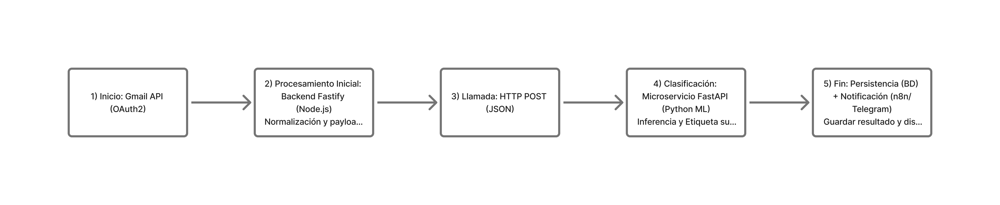

# 🧩 Email Cleaner & Smart Notifications


An intelligent system that automatically classifies your emails, prioritizes what truly matters, and alerts you when action is needed.  
Built with **Fastify (Node.js)** for backend logic, **FastAPI (Python)** for machine learning, and **n8n** for smart automation.

---

## 🚀 Overview

Managing dozens of emails daily can easily lead to **decision fatigue** and **loss of focus**.  
This system connects securely to Gmail, classifies messages with ML models, and filters what deserves your attention.



---

## 🧠 Core Features

- **Smart Classification** — NLP-based categorization of incoming emails.  
- **Priority Notifications** — Only alerts you for messages that matter.  
- **Seamless Gmail Integration** — OAuth2-based secure connection.  
- **Multi-service Architecture** — Node.js backend + Python ML microservice.  
- **Automation-ready** — n8n workflows for Telegram or Slack notifications.

---

## 🧱 Architecture Overview

| Layer           | Technology         | Purpose                          |
| --------------- | ------------------ | -------------------------------- |
| Frontend        | React + Vite       | Web interface and control panel  |
| Backend API     | Fastify (Node.js)  | Business logic and orchestration |
| ML Microservice | FastAPI (Python)   | Email classification engine      |
| Database        | PostgreSQL         | Data persistence                 |
| Infrastructure  | Docker + Cloud Run | Deployment and scalability       |

---

## ⚙️ Setup Instructions

> ⚠️ **Requirements:** Node.js ≥ 20.0  •  Python ≥ 3.10  •  Docker (optional)  
> Ensure you have both environments active before running the backend and ML microservice.

### 1. Clone the Repository

```bash
git clone https://github.com/gtovar/email-cleaner.git
cd email-cleaner
```

### 2. Environment Setup

Copy the environment example and fill in your Gmail credentials:

```bash
cp .env.example .env
```

### 3. Install Dependencies

**Backend:**
```bash
npm install
```

**ML Microservice:**
```bash
cd python/classifier
python -m venv venv
source venv/bin/activate
pip install -r requirements.txt
```

### 4. Run the Services

**Fastify Backend:**
```bash
npm run dev
# http://localhost:3000
```

**Python Classifier (FastAPI):**
```bash
uvicorn main:app --reload --port 8000
# http://localhost:8000/docs
```

---

## 🧪 Testing the Pipeline

To test classification end-to-end:

```bash
curl -X POST http://localhost:3000/api/v1/emails/classify -H "Content-Type: application/json" -d '{
  "from": "invoices@cfe.mx",
  "subject": "Your electricity bill is ready",
  "body": "Due date: November 15. Amount: $350."
}'
```

Expected result:
```json
{
  "category": "Finance/Utilities/CFE",
  "action": "archive",
  "confidence": 0.93
}
```
# Trigger notification test
curl -X POST http://localhost:5678/webhook/telegram-test

---

## 📦 Related Documentation

| File                     | Description                           |
| ------------------------ | ------------------------------------- |
| [`DESIGN_DOCUMENT.md`](https://gtovar.github.io/email-cleaner-fastify/DESIGN_DOCUMENT.html) | Technical design rationale |
| `API_REFERENCE.md`       | REST API specification                |
| `architecture.md`        | Mermaid architecture diagram          |
| `despliegue-cloudrun.md` | Deployment guide for Google Cloud Run |
| `migraciones.md`         | Database migration guide              |
| `seeders.guia.md`        | Seeder reference                      |

---

## 🧰 Tech Stack Summary

- **Backend:** Node.js (Fastify), PostgreSQL  
- **ML Service:** Python (FastAPI, scikit‑learn)  
- **Infra:** Docker, Cloud Run, Secret Manager  
- **Notifications:** n8n + Telegram integration
- **CI/CD:** GitHub Actions (build + deploy + lint)
- **Monitoring:** ELK Stack / Prometheus (optional phase 4)

---

## 🧾 License and Maintainers

Maintained by **Gilberto Tovar**  
📧 contacto@gilbertotovar.com
🌐 [www.gilbertotovar.com](https://www.gilbertotovar.com)

---
# pre-commit hook
sed -i "s/Last updated:.*/Last updated: $(date '+%B %Y')/" README.md

