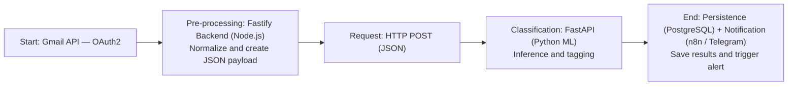
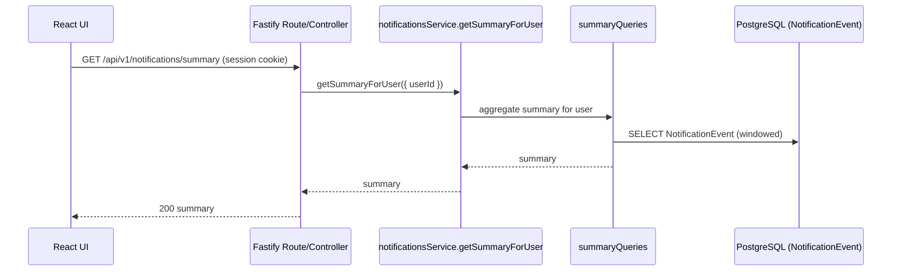
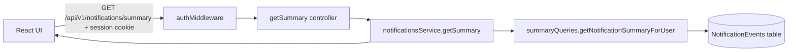

# System Architecture Diagram

This diagram represents the main data flow of the **Email Cleaner & Smart Notifications** system.



## Backend Event Flows (CQRS-lite + EventBus)

### Summary Flow (GET /api/v1/notifications/summary)





### Confirm Flow (POST /api/v1/notifications/confirm)


#### Semantics (to avoid future confusion)
- `ActionHistory` answers: "Which action did the user execute/confirm on which email?"
- `NotificationEvent` answers: "Which domain events occurred and how do they travel through the pipeline?"
- Both coexist by design: the UI needs a simple history; the system needs auditable events.


```mermaid
flowchart LR
  UI[React UI] -->|POST /api/v1/notifications/confirm {emailIds, action}| MW[authMiddleware]
  MW --> CTRL[confirmActions controller]
  CTRL --> SVC[notificationsService.confirmActions]
  SVC --> CMD1[confirmActionCommand]
  CMD1 --> EXT[Gmail API / side effects (if applicable)]
  SVC --> BUS[eventBus.publish: DOMAIN_EVENTS.SUGGESTION_CONFIRMED]
  BUS --> L1[listener: saveToNotificationEvent]
  L1 --> CMD2[recordNotificationEventCommand]
  CMD2 --> DB[(NotificationEvents table)]
  SVC --> UI
```

---

## Stage Descriptions

### 1️⃣ Start: Gmail API (OAuth2)
- Fetches incoming emails securely using OAuth2 tokens.  
- Read‑only access; no local credential storage.

### 2️⃣ Pre‑Processing: Fastify Backend
- Normalizes and sanitizes the email payload.  
- Converts raw Gmail data into a standardized JSON schema.  
- Logs structural anomalies for debugging.

### 3️⃣ HTTP POST Request
- The backend sends the JSON payload to the Python microservice.  
- Includes an internal authentication token for inter‑service trust.

### 4️⃣ Classification: FastAPI (Python ML)
- Executes a machine‑learning model for text classification.  
- Returns both the **predicted classification** and **recommended action** (archive, notify, label).

### 5️⃣ Persistence & Notification
- Fastify writes classification results to PostgreSQL.  
- Triggers n8n / Telegram notification workflows if required.  
- Returns the final response to the React frontend.

---

## Technical Notes

- **Communication:** RESTful HTTP between Node.js ↔ Python.  
- **Security:** Internal JWT tokens between microservices.  
- **Observability:** Centralized logging via Cloud Logging.  
- **Fault Tolerance:** Automatic retries for transient network failures.  

---

**Last updated:** July 2025  
