# 🏗️ System Architecture Diagram

This diagram represents the main data flow of the **Email Cleaner & Smart Notifications** system.

---

## 🔄 Stage Descriptions

### 1️⃣ Start: Gmail API (OAuth2)
- Fetches incoming emails securely using OAuth2 tokens.  
- Read‑only access; no local credential storage.

### 2️⃣ Pre‑Processing: Fastify Backend
- Normalizes and sanitizes the email payload.  
- Converts raw Gmail data into a standardized JSON schema.  
- Logs structural anomalies for debugging.

### 3️⃣ HTTP POST Request
- The backend sends the JSON payload to the Python microservice.  
- Includes an internal authentication token for inter‑service trust.

### 4️⃣ Classification: FastAPI (Python ML)
- Executes a machine‑learning model for text classification.  
- Returns both the **predicted category** and **recommended action** (archive, notify, label).

### 5️⃣ Persistence & Notification
- Fastify writes classification results to PostgreSQL.  
- Triggers n8n / Telegram notification workflows if required.  
- Returns the final response to the React frontend.

---

## ⚙️ Technical Notes

- **Communication:** RESTful HTTP between Node.js ↔ Python.  
- **Security:** Internal JWT tokens between microservices.  
- **Observability:** Centralized logging via Cloud Logging.  
- **Fault Tolerance:** Automatic retries for transient network failures.  

---

**Last updated:** July 2025  