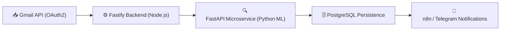

# 📬 Email Cleaner & Smart Notifications

> **Smart AI‑powered system to organize your Gmail inbox, declutter irrelevant emails, and notify you only when action is required.**

---

## 🌐 Overview

Email Cleaner & Smart Notifications automatically connects to your Gmail account using **OAuth 2.0**, classifies incoming messages via a **FastAPI ML microservice**, and orchestrates automation through **n8n flows** for Telegram or Slack alerts.

---

## 🧠 Architecture at a Glance



---

## ⚙️ Key Features

- **AI‑based classification** — Detects type and intent of each email.  
- **Priority Filtering** — Shows only messages that matter.  
- **Secure OAuth2 integration** — No stored passwords or IMAP usage.  
- **Automation Ready** — Easily connect rules to n8n workflows.  
- **Modular Architecture** — Node.js ↔ Python ↔ Cloud Run.  

---

## 🧭 Quick Start

1. **Clone the repo**
   ```bash
   git clone https://github.com/gtovar/email-cleaner.git
   cd email-cleaner
   ```

2. **Run locally**
   ```bash
   npm install
   npm run dev
   ```

3. **Start ML microservice**
   ```bash
   cd python/classifier
   python -m venv venv
   source venv/bin/activate
   pip install -r requirements.txt
   uvicorn main:app --reload --port 8000
   ```

4. **Open API docs**
   - Fastify API → [http://localhost:3000/docs](http://localhost:3000/docs)  
   - FastAPI ML Service → [http://localhost:8000/docs](http://localhost:8000/docs)

---

## 📚 Documentation Index

| Section | Description |
| -------- | ------------ |
| [🧠 Design Document](./DESIGN_DOCUMENT.md) | Technical architecture and key decisions |
| [📡 API Reference](./API_REFERENCE.md) | REST endpoints and examples |
| [⚡ Quickstart Guide](./TUTORIALS/QUICKSTART.md) | Run the project locally in minutes |
| [🗄️ Database Migrations](./migraciones.md) | Sequelize migration workflow |
| [🌱 Seeders Guide](./seeders.guia.md) | Load initial or reference data |
| [🚀 Deploy to Cloud Run](./despliegue-cloudrun.md) | Cloud Build + Cloud Run deployment steps |
| [🤝 Contribution Guide](../CONTRIBUTION.md) | Collaboration and commit standards |

---

## 🧰 Technology Stack

| Layer | Technology | Purpose |
| ----- | ----------- | -------- |
| **Frontend** | React + Vite | Dashboard and user control panel |
| **Backend API** | Fastify (Node.js) | Core business logic + REST services |
| **ML Microservice** | FastAPI (Python) | NLP classification engine |
| **Database** | PostgreSQL | Structured data storage |
| **Infrastructure** | Docker + Cloud Run | Reproducible and scalable deployments |

---

## 🧾 Maintainers

Maintained by **Gilberto Tovar**  
📧 contacto@gilbertotovar.com       
🌐 [www.gilbertotovar.com](https://www.gilbertotovar.com)

---

**Last updated:** November 2025 — Architecture Team  

